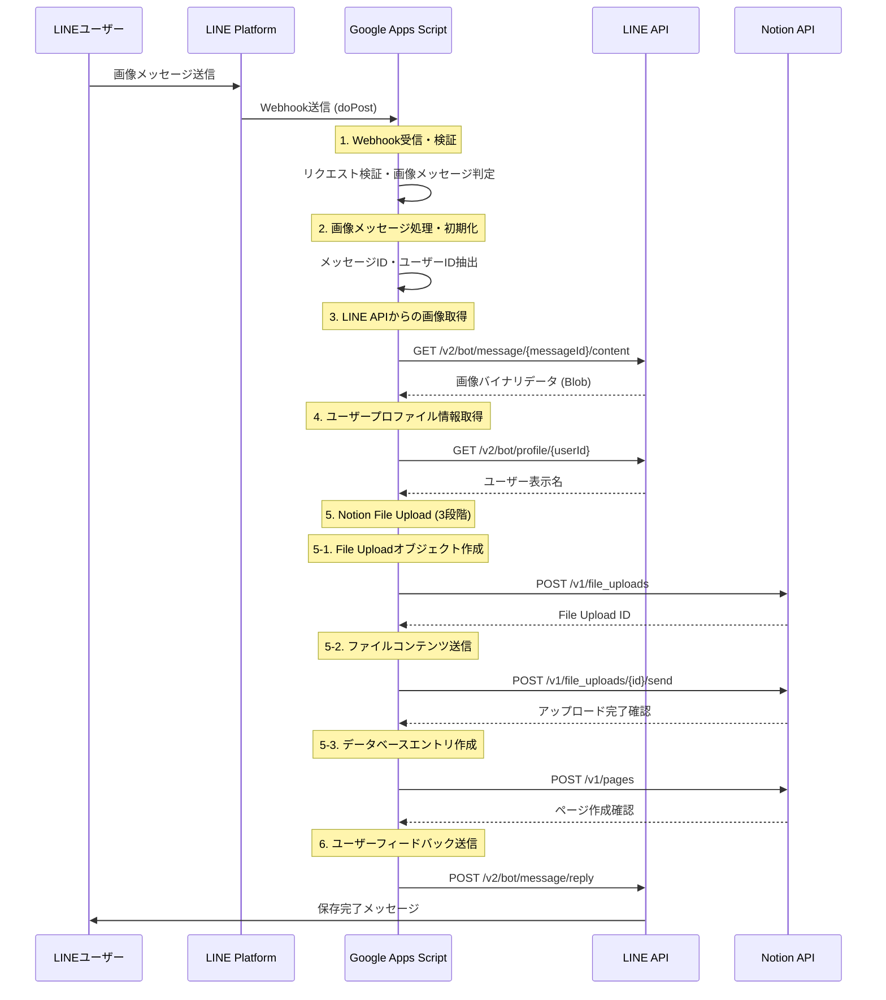

# NotionMediaUploader

## 概要
NotionMediaUploaderは、LINEで受け取った画像を自動的にNotionデータベースに保存するGoogle Apps Scriptプロジェクトです。LINEボットを通じて写真を送信すると、Notionの指定されたデータベースに画像がアップロードされ、メタデータ（送信者名、日時など）と共に保存されます。

## 機能
- LINEからの画像メッセージを自動で受信
- 受信した画像をNotionのデータベースにアップロード
- 送信者名、受信日時などのメタデータを一緒に保存
- アップロード完了時にLINEユーザーへ確認メッセージを送信

## データフロー

本システムは以下の6段階のプロセスで画像の転送・保存を行います：

### シーケンス図



### 1. LINE Webhook受信・検証
- **関数**: `doPost(e)`
- **処理内容**: 
  - LINEプラットフォームからのWebhookリクエストを受信
  - リクエストボディの存在確認とJSON形式での解析
  - イベント配列の検証（`data.events`の存在確認）
  - 画像メッセージイベント（`type === 'message'` かつ `message.type === 'image'`）のフィルタリング
- **エラーハンドリング**: 不正なリクエストでも`200 OK`を返してLINEの再送を防止

### 2. 画像メッセージ処理・初期化
- **関数**: `handleImageMessage(event)`
- **処理内容**:
  - メッセージIDとユーザーIDの抽出（`event.message.id`, `event.source.userId`）
  - 後続処理の初期化とログ出力
  - エラー発生時のユーザーへの適切なフィードバック準備
- **データ**: `messageId`, `userId`, `replyToken`, `timestamp`

### 3. LINE APIからの画像取得
- **関数**: `getImageFromLine(messageId)`
- **API呼び出し**: `GET https://api-data.line.me/v2/bot/message/{messageId}/content`
- **認証**: `Authorization: Bearer {LINE_CHANNEL_ACCESS_TOKEN}`
- **処理内容**:
  - LINE Content APIを使用してバイナリ画像データを取得
  - レスポンスをGoogle Apps ScriptのBlobオブジェクトに変換
  - ファイル形式の自動判定（主にJPEG/PNG）
- **戻り値**: `Blob`オブジェクト（バイナリ画像データ）

### 4. ユーザープロファイル情報取得
- **関数**: `getUserName(userId)`
- **API呼び出し**: `GET https://api.line.me/v2/bot/profile/{userId}`
- **認証**: `Authorization: Bearer {LINE_CHANNEL_ACCESS_TOKEN}`
- **処理内容**:
  - LINEユーザーの表示名（`displayName`）を取得
  - API呼び出し失敗時のフォールバック処理（`User_{userId前8文字}`）
- **戻り値**: ユーザー表示名（文字列）

### 5. Notion File Upload API経由でのアップロード（3段階プロセス）

#### 5-1. File Uploadオブジェクト作成
- **関数**: `createFileUpload(imageBlob)`
- **API呼び出し**: `POST https://api.notion.com/v1/file_uploads`
- **認証**: `Authorization: Bearer {NOTION_API_TOKEN}`
- **リクエストボディ**:
  ```json
  {
    "filename": "line_photo_{ISO8601タイムスタンプ}.jpg",
    "content_type": "image/jpeg"
  }
  ```
- **戻り値**: File Uploadオブジェクト（`id`フィールドを含む）

#### 5-2. ファイルコンテンツ送信
- **関数**: `sendFileContent(fileUploadId, imageBlob)`
- **API呼び出し**: `POST https://api.notion.com/v1/file_uploads/{fileUploadId}/send`
- **認証**: `Authorization: Bearer {NOTION_API_TOKEN}`
- **データ形式**: `multipart/form-data`
- **処理内容**:
  - 実際の画像バイナリデータをNotionのストレージに送信
  - アップロード状況の確認（`status: 'uploaded'`）
- **戻り値**: アップロード結果オブジェクト

#### 5-3. Notionデータベースエントリ作成
- **関数**: `createNotionDatabaseEntry(fileUploadId, userName, timestamp)`
- **API呼び出し**: `POST https://api.notion.com/v1/pages`
- **認証**: `Authorization: Bearer {NOTION_API_TOKEN}`
- **リクエストボディ**:
  ```json
  {
    "parent": {"database_id": "{NOTION_DATABASE_ID}"},
    "properties": {
      "タイトル": {"title": [{"text": {"content": "写真 - {日時}"}}]},
      "画像": {"files": [{"type": "file_upload", "file_upload": {"id": "{fileUploadId}"}, "name": "photo_{timestamp}.jpg"}]},
      "送信者": {"rich_text": [{"text": {"content": "{userName}"}}]},
      "受信日時": {"date": {"start": "{YYYY-MM-DD}"}}
    }
  }
  ```
- **処理内容**: アップロードされたファイルをデータベースエントリとして関連付け

### 6. ユーザーフィードバック送信
- **関数**: `replyToUser(replyToken, message)`
- **API呼び出し**: `POST https://api.line.me/v2/bot/message/reply`
- **認証**: `Authorization: Bearer {LINE_CHANNEL_ACCESS_TOKEN}`
- **処理内容**:
  - 成功時: "写真をNotionに保存しました！📸"
  - 失敗時: 適切なエラーメッセージ
- **応答形式**: LINE Reply Message API形式

### エラーハンドリング戦略
- **各段階での例外捕捉**: `try-catch`ブロックによる個別エラー処理
- **ログ出力**: `console.log`/`console.error`による詳細なトレーシング
- **グレースフルデグラデーション**: 部分的失敗時の適切なフォールバック
- **LINE再送防止**: エラー時でも`200 OK`レスポンスを返却

### データ変換・形式
- **画像データ**: LINE API → Blob → Notion File Upload API
- **日時データ**: UNIX timestamp → ISO8601 → YYYY-MM-DD（Notion Date）
- **テキストデータ**: LINE displayName → Rich Text format（Notion）

## セットアップ方法
1. **前提条件**
   - LINEの開発者アカウント
   - NotionのAPI統合設定
   - Google Apps Script環境

2. **スクリプトプロパティの設定**
   Google Apps Scriptのプロジェクト設定で以下のスクリプトプロパティを設定します：
   - `LINE_CHANNEL_ACCESS_TOKEN`: LINEのチャネルアクセストークン
   - `NOTION_API_TOKEN`: NotionのAPI統合トークン
   - `NOTION_DATABASE_ID`: 画像を保存するNotionデータベースのID

3. **Notionデータベースの準備**
   以下のプロパティを持つデータベースをNotionで作成します：
   - `タイトル`: タイトルプロパティ（Title型）
   - `画像`: ファイルプロパティ（Files型）
   - `送信者`: テキストプロパティ（Rich Text型）
   - `受信日時`: 日付プロパティ（Date型）

4. **Webhookの設定**
   - スクリプトをデプロイしてWebアプリとして公開
   - 生成されたURLをLINE MessagingのWebhook URLとして設定

## 使用方法
1. LINEボットと友達になる
2. ボットに画像を送信
3. 自動的にNotionデータベースに画像が保存される
4. 保存完了後、LINEで確認メッセージが届く

## デバッグ機能
- `debugConfiguration()`: 設定の確認とAPI接続テスト
- `checkNotionDatabase()`: Notionデータベース構造の確認
- `testWebhook()`: Webhookの動作テスト

## 注意事項
- セキュリティのため、本番環境では必ずLINE Webhookの署名検証を有効にしてください
- Notionデータベースの構造変更時は、スクリプト内のプロパティ名も更新する必要があります
